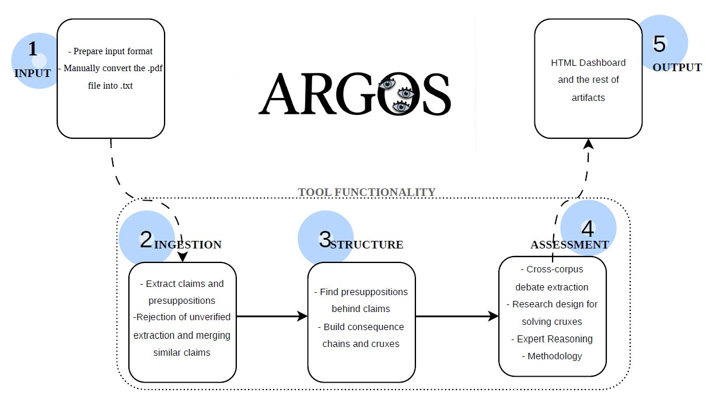

# ARGOS

<p align="center">
  
</p>

Goal: epistemic analysis pipeline for document cases: extracts claims, presuppositions, cruxes, cross-source debate, and expert reasoning. **Not a summarizer.**

## Pipeline Prototype

ARGOS turns a set of documents (papers, debate transcripts, judge decisions) into a structured map of claims, evidence, contradictions, and the open disagreements ("cruxes") that actually drive a debate. It is not a summarizer: every output is meant to be traceable back to a specific quote in a specific source (see the artifact `graph.json`).
There is a list of many critical elements to fix and to implement, this is a preliminary approach.

---

## Built-in safeguards

- **Claims must be evidence-grounded:** cited quotes are checked against the source text before a claim is kept (`episteme/filters/quote_gate.py`, applied in `episteme/pipeline/ingest.py`). Paraphrases across papers merge into one canonical claim labeled by convergence (well_established / supported / single_source / contested) — see `episteme/pipeline/reconcile.py`.

- **Hypothesis generation cannot invent numbers:** every figure in a proposed study must trace to real evidence, a named external standard, or is marked ungrounded / TBD. A second, independent pass re-checks every grounding claim against the literal source text and logs every override (`episteme/pipeline/hypothesis.py`, `episteme/pipeline/hypothesis_verify.py`, prompts in `episteme/prompts/hypothesis.py`).

- **Quote integrity is actively maintained, not just trusted:** dedicated passes extend truncated quotes to full sentences (`episteme/filters/quote_repair.py`) and flag evidence whose source stance conflicts with the claim it is attached to (`episteme/pipeline/attestation_stance.py`).

- **A source's importance is computed from the finished graph** (unique claims, crux-relevance) rather than assumed upfront from who wrote it — see `episteme/compile/source_importance.py`, output in `compiled/source_importance.json`.
---

## Setup

```bash
git clone <repo-url> && cd ARGOS
python -m venv .venv
.venv\Scripts\activate        # Windows
source .venv/bin/activate     # macOS / Linux
pip install -r requirements.txt
# add ANTHROPIC_API_KEY=sk-... to a .env file
```

---

## Adding a case (required before running)

A case is just a named folder of input documents. To make ARGOS recognize it:

**1. Create the folder structure** under `cases/`:

```
cases/my_case/
├── sources.json      # manifest: one entry per source
└── files/            # plain-text source bodies (.txt)
    ├── paper_a.txt
    └── paper_b.txt
```

Convert PDFs to `.txt` before ingest. YouTube debates are auto-transcribed: leave `local_path` as `null` and provide the `url`.

**2. Write `sources.json`** — one object per document:

```json
[
  {
    "local_path": "cases/my_case/files/paper_a.txt",
    "url": "https://example.com/paper_a",
    "author": "Author Name",
    "date": "2024-03-28",
    "content_type": "text"
  },
  {
    "local_path": null,
    "url": "https://www.youtube.com/watch?v=VIDEO_ID",
    "author": "Channel Name",
    "date": "2023-12-30",
    "content_type": "video"
  }
]
```

Accepted `content_type` values: `text`, `pdf`, `video`, `audio`, `web`.

**3. Register the case** in `episteme/config.py` — add the folder name to `VALID_CASES`:

```python
VALID_CASES = ["covid", "use_case", "my_case"]
```

Without this step, `main.py` will reject `--case my_case` as an invalid choice.

---

## How it works — 5 stages

| Stage | Steps | What happens |
|-------|-------|--------------|
| **1. Input** | (manual) | You provide sources.json (a manifest) and files/ (plain text per source). YouTube debate sources are auto-transcribed at ingest. No LLM calls yet — this stage only defines what ARGOS will read. |
| **2. Ingestion** | ingest, reconcile | Extracts claims and evidence per source, checking each cited quote against the actual source text. Then merges paraphrased claims across papers into single canonical claims with combined attestations. |
| **3. Structure** | structure, crystallize | Finds the unstated assumptions behind each claim, then compresses the full graph into themes, argument chains, and cruxes (see callout below). |
| **4. Assessment** | relate, debate, hypothesis, reasoning, methodology, assess | Cross-paper contradictions, a proposed research design per crux, a skeptical "expert" reasoning layer, per-paper methodology scoring, and a full audit report. |
| **5. Output** | build_dashboard.py | An interactive dashboard with four tabs (Cruxes, Debate, Reasoning, Methodology). The full markdown report and raw graph stay available for complete traceability. |

> **Why crystallize, not just the raw graph?** A real case graph can hold hundreds of claim nodes — unreadable as a list. Crystallize compresses that into the handful of cruxes that would actually move the debate if resolved: it is the step that turns "everything every paper said" into "here is what is actually in dispute."

---

## Full pipeline

```bash
python main.py --case {case} --step ingest
python main.py --case {case} --step reconcile
python main.py --case {case} --step structure
python main.py --case {case} --step crystallize
python main.py --case {case} --step relate
python main.py --case {case} --step debate
python main.py --case {case} --step assess
python main.py --case {case} --step methodology
python main.py --case {case} --step hypothesis
python main.py --case {case} --step reasoning
python scripts/build_dashboard.py --case {case}
```

Replace `{case}` with your case folder name (e.g. `covid`, `my_case`). Cached LLM responses live in `cache/{case}/` — re-running a step without changes costs ~$0.

---

## Example case

A preliminary run on a COVID-origins debate (judge ruling, papers, debate transcript) is included: open `cases/covid/dashboard.html` to see all four tabs populated end-to-end. The Epistemic Health Report for the same case is at [`reports/covid_report.md`](reports/covid_report.md).
